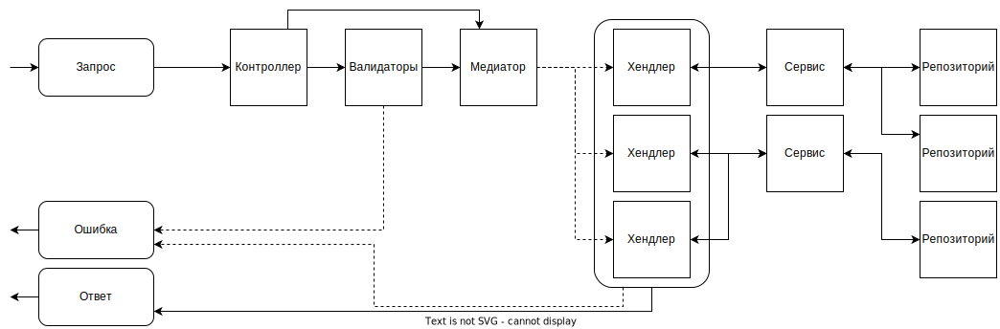

# Hotel rooms service
Наш сервис выступает фасадом между сервисами отелей и нашим кластером. Наш сервис -
основной источник информации для остальных сервисов в сети.

## Как работает?

Как видите, в решении находится куча проектов. Я решил разделить зону ответственности
каждого проекта чтобы было понятнее что где находится и чтобы мы добились слабой
связности.

Вкратце, у нас такая схема обработки запросов:

Сейчас распишу это детальнее
1. Запрос приходит как жсон
2. Запрос находит свой контроллер, оттуда он узнает к какому классу ему
нужно преобразоваться
3. Проходит валидацию если для него предусмотрены валидаторы
4. Запрос передается в медиатор
5. Медиатор находит для запроса его обработчик
6. Обработчик может (и будет) обращаться к сервисам
7. Сервисы могут (и будут) обращаться к репозиториям
8. После того как хендлер закончил свою логику он возвращает
объект-ответ
9. Ответ сериализуется и возвращается клиенту как json

А теперь по тезаурусу

### Репозиторий
Это абстрактное хранилище данных. Репозиторий не должен
содержать логики, он просто сохраняет данные и получает
их. Логика и проверки - не его уровень ответственности.
В нашем случае оно работает через EFCore, но мы достигаем 
абстракции через интерфейсы. Если нам нужно пользоваться 
каким-то репозиторием то мы его **инжектим** 
через конструктор в виде интерфейса
```csharp
public class HotelsEfCoreRepository:
    EfCoreRepositoryBase<Hotel>,
    IHotelsRepository
{
    //Код
}
```
в данном случае мы содержим всю логику в интерфейсе
IHotelsRepository, наш класс ее просто реализует.
Регистрировать сервис вручную не нужно, за нас это
сделает Scrutor.

### Сервис
Это более высокоуровневая сущность, которая содержит логику
одной предментой области и часто связана с одной или
несколькими сущностями. Сервисы мы также абстрагируем через
интерфейсы но при этом их нужно объявить слегка иначе
```csharp
[DefaultService]
public class DefaultHotelsService : IHotelsService
{
    //Код
}
```
Здесь чтобы Scrutor нашел наш сервис его нужно пометить
аттрибутом [DefaultService].

### Хендлер
Так как мы хорошие шарписты, мы любим когда все строго
типизировано, в том числе запросы, приходящие в виде json.
Эти типы хранятся в `Core.Requests`. Ответы сервера также
строго типизируем и храним в `Core.Responses`.

Хендлер это сущность из библиотеки MediatR которая содержит
основную логику и оркестрирует наши сервисы. Он содержит
единственный метод Handle который принимает запрос
и возвращает ответ. Внутри хендлера можно вызывать любые
сервисы, но не репозитории, потому что нужно соблюдать
слоистость.

### Бонус

#### 404
Если какая-либо искомая сущность не была найдена то лучше
бросать исключение `NotFoundException`, так как в таком
случае у ответа будет статус-код 404, как и надо. 
Также есть метод `NotFoundException.ThrowIfNull(object?)`
который выбросит это исключение если переданный объект
равен null (например функции поиска в БД могут вернуть
null если не найдут совпадений).

#### Миграции
Чтобы создать миграции через `dotnet ef migrations add`
то увидите что нихуя не просто в этой жизни. Из-за того
что у нас много проектов мы должны указать при создании
миграции дополнительные аргументы
```
--project Core.Data\Core.Data.csproj 
--startup-project API\API.csproj 
--context Core.Data.ApplicationContext 
--output-dir Migrations
```
Тогда все круто сработает.
